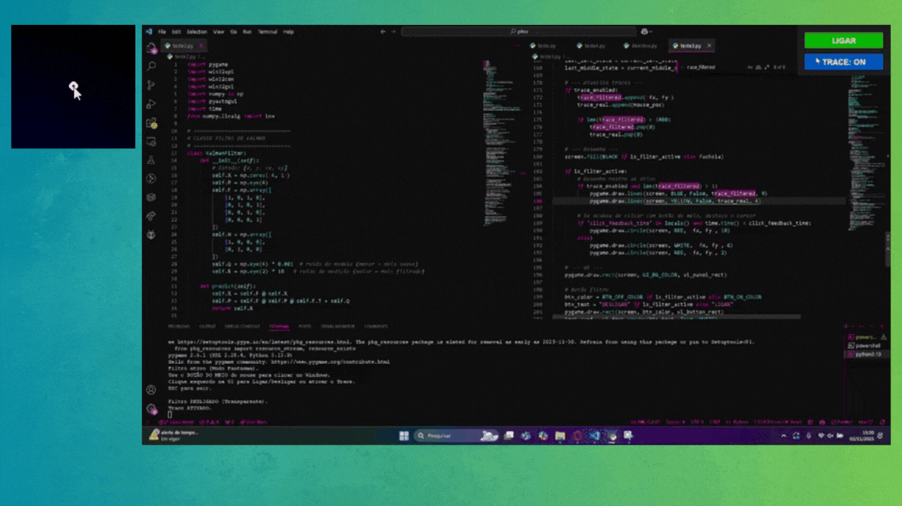

# 🖱️ Ponto Firme
Ponto Firme é um projeto desenvolvido durante o Hackathon USP 2025, com o objetivo de devolver autonomia digital a pessoas que vivem com tremores essenciais ou Doença de Parkinson — condições que dificultam o uso de mouses e interfaces digitais.

[📄 Ver slides do pitch](./Pitch%20Hackathon.pdf)

## 💡 Ideia
O projeto utiliza um filtro de Kalman para prever e suavizar o movimento do cursor, reduzindo os efeitos dos tremores involuntários.
A solução visa tornar o uso do computador mais acessível, confortável e preciso para pessoas com limitações motoras finas.

## ⚙️ Como funciona
1. Captura os movimentos do cursor em tempo real.
2. Aplica o filtro de Kalman para prever a posição desejada e reduzir flutuações.
3. Atualiza a posição suavizada do cursor na tela.

## 🧩 Tecnologias utilizadas

- Python
- Pygame (para interface gráfica e controle do cursor)
- NumPy (para cálculo matricial do filtro)

## 🤝 Equipe

- Adan Lucas
- Kauã Moreno
- Kauã Nichioka
- Leonardo Bezerra
- Ryan Oliveira

## 📈 Impacto

- Devolver o prazer de jogar, criar e se conectar.
- Resgatar a autonomia em atividades digitais cotidianas.
- Assegurar o direito à dignidade e à inclusão digital.